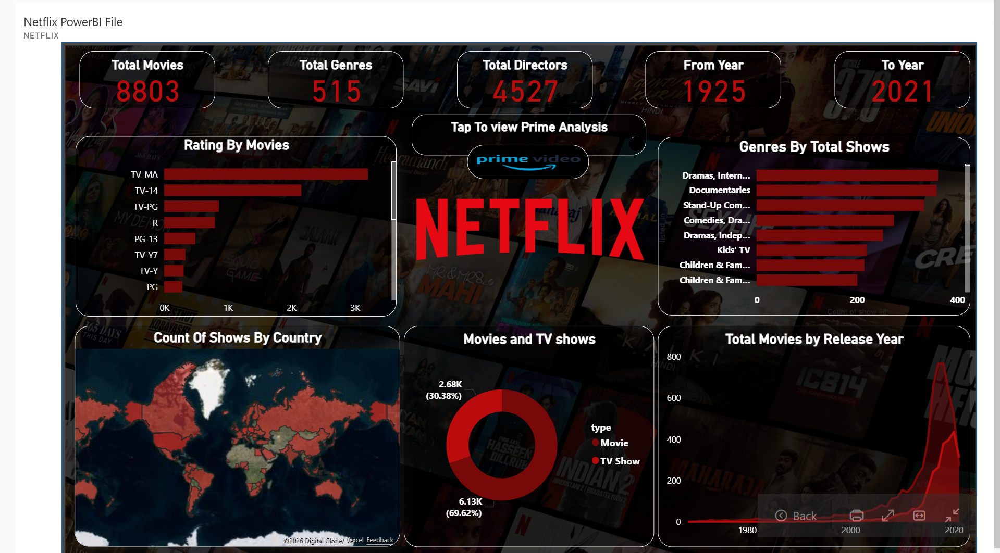
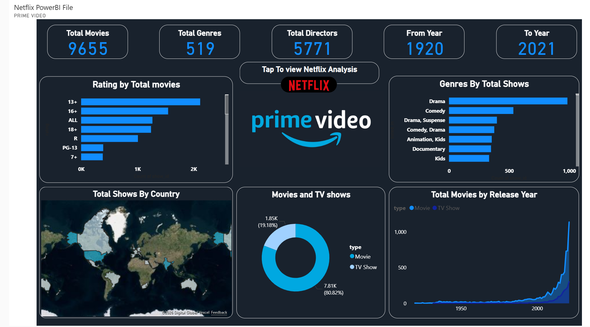

# 🎬 Netflix Dashboard Analysis

---

## 🧭 Overview

This project presents a **Netflix dashboard visualization** that provides insights into content distribution, trends, and platform composition.

The dashboard focuses on understanding:
- Content growth trends  
- Distribution of Movies vs TV Shows  
- Genre popularity  
- Country-wise content availability  

---

## 📊 Dashboard

---

## 🔍 Key Insights

- 📈 Significant increase in content after 2015  
- 🎬 Movies dominate compared to TV Shows  
- 🌍 Content availability varies across countries  
- 🎭 Certain genres are more popular than others  
- 📅 Increasing trend in content additions over time  

---

## 🎯 Purpose

The goal of this dashboard is to:
- Provide a **visual overview of streaming content trends**
- Enable quick understanding of **content distribution**
- Support **data-driven observations** through visualization  

---

## 🧠 Learning Outcome

- Improved understanding of **dashboard interpretation**
- Learned how to extract **insights from visual data**
- Developed **data storytelling skills using dashboards**

---

## 📌 Note

This project is based on **dashboard analysis and interpretation** using existing visualization.

---

## 👤 Author

Vivek Kumar Singh 
🔗 [LinkedIn](https://linkedin.com/in/vivek-kumar-singh-338ba91b9)
💻 [GitHub](https://github.com/vivek70132)
