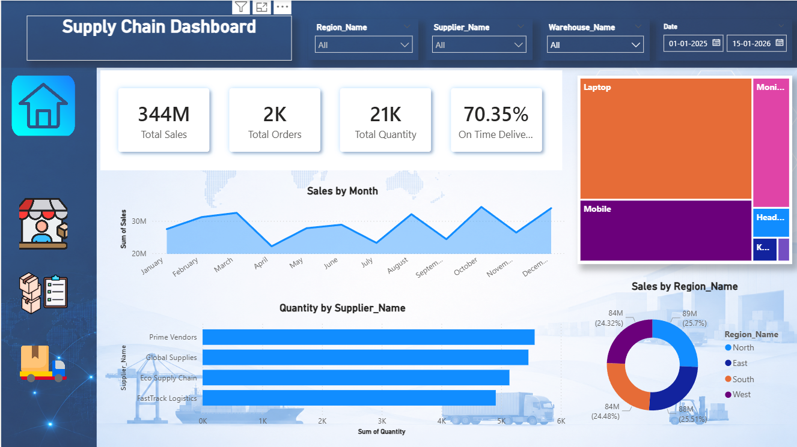
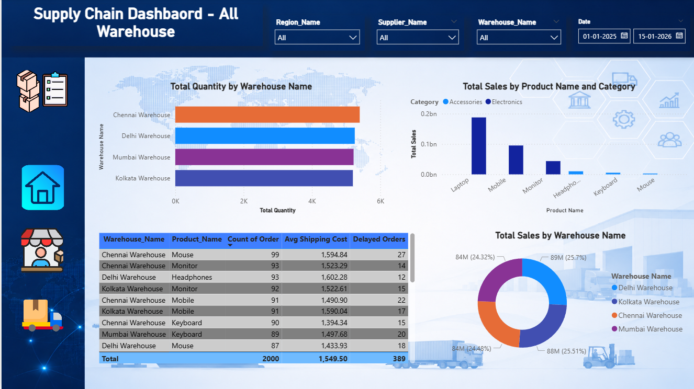
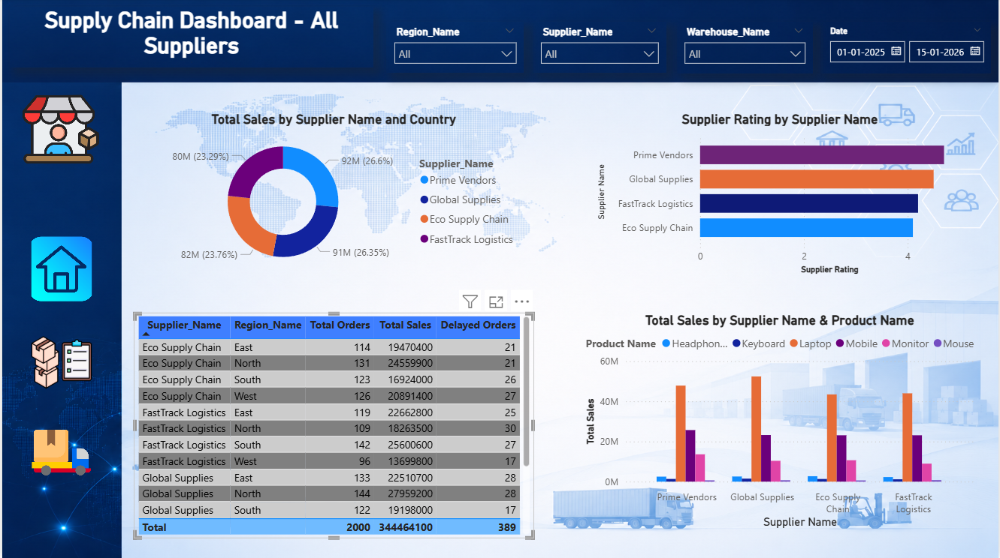
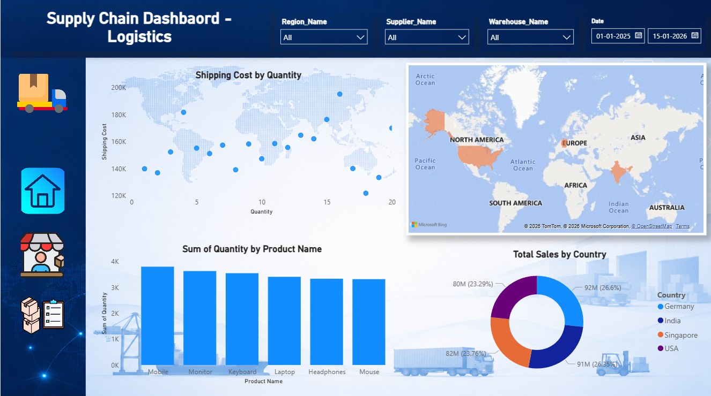
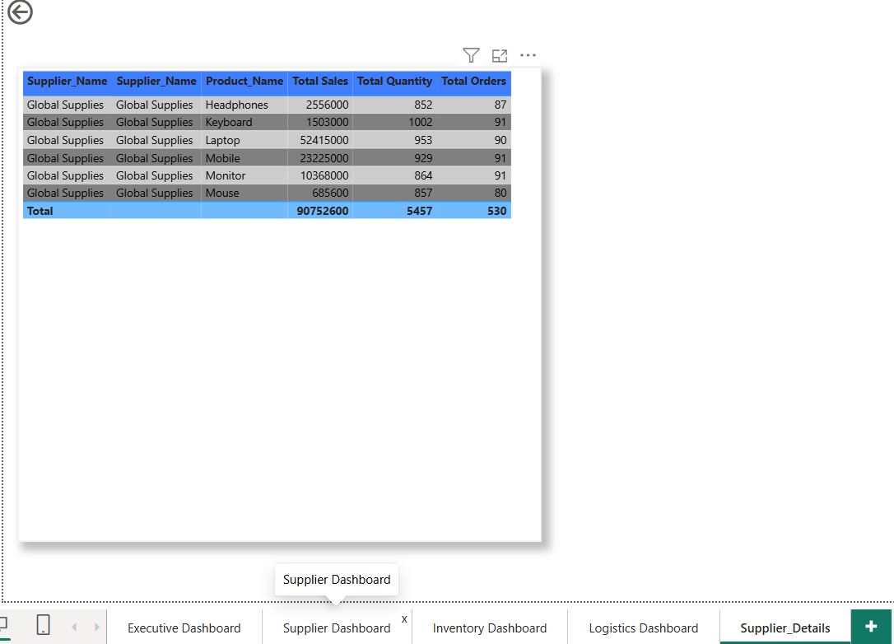
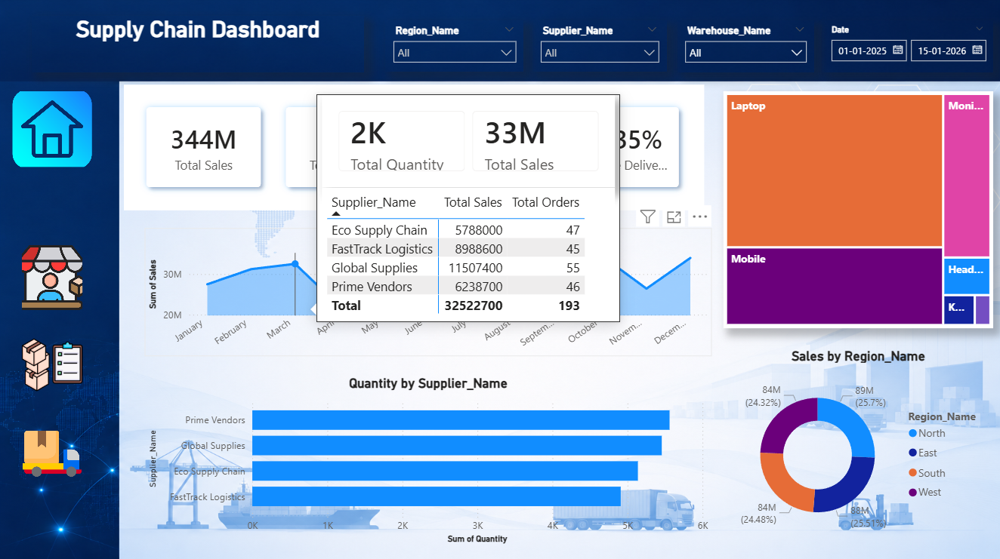
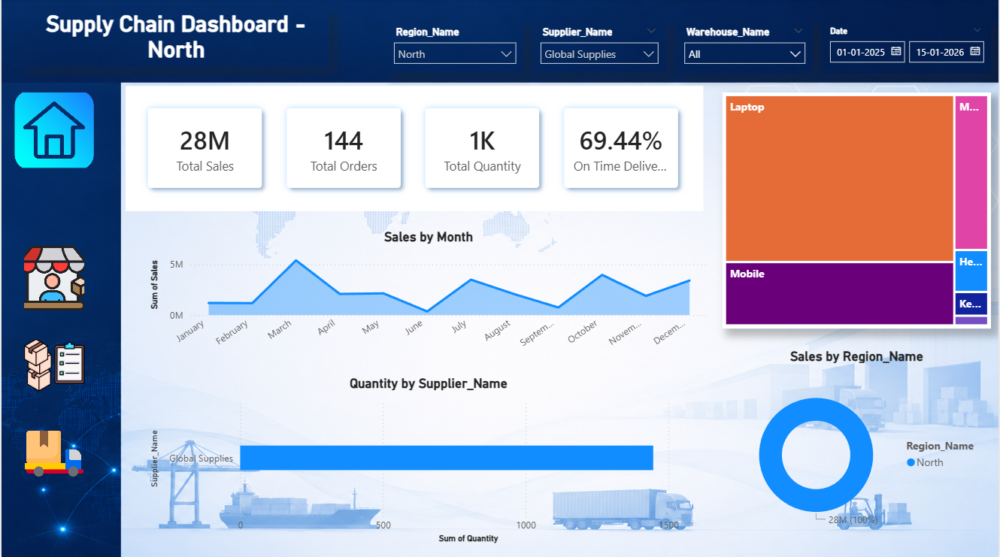
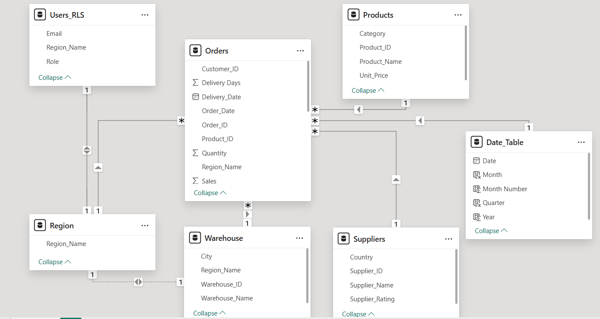
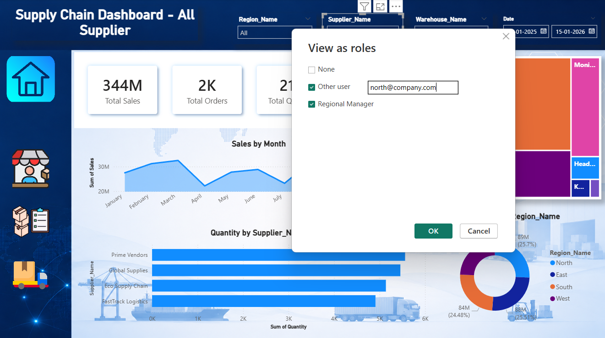
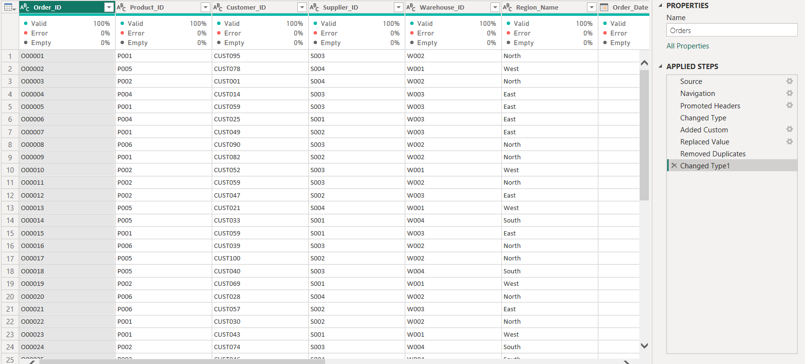

# 📊 Supply Chain Analytics Dashboard (Power BI)


---

## 🧭 Overview

This project presents an **end-to-end Supply Chain Analytics Dashboard** developed using **Microsoft Power BI** to analyze and monitor:

- Supplier Performance
- Inventory Management
- Logistics Operations
- Shipment Delays
- Transportation Costs
- Warehouse Operations
- Region-wise Performance

The dashboard provides interactive insights through:
- Drillthrough Analysis
- Dynamic Tooltips
- Dynamic Titles
- Cross Filtering
- Dynamic Row Level Security (RLS)

The project integrates data from:
- Excel Files
- MySQL Database

---

## 🎯 Business Problem

Organizations managing large-scale supply chain operations require centralized visibility into:

- Supplier efficiency
- Delayed shipments
- Inventory movement
- Transportation costs
- Operational bottlenecks

Manual reporting processes make it difficult to:
- Monitor KPIs in real time
- Perform detailed supplier analysis
- Secure region-specific reporting
- Identify logistics inefficiencies

This dashboard solves these challenges using interactive business intelligence reporting.

---

## 🛠️ Tech Stack

- Microsoft Power BI
- Power Query
- DAX
- Excel
- MySQL
- Data Modeling
- Row Level Security (RLS)
- GitHub

---

## 📂 Data Sources

### 📄 Excel Source
Used for:
- Orders Data
- Product Data
- Warehouse Data
- Region Data

### 🗄️ MySQL Source
Used for:
- Supplier Master Data
- User Access Mapping
- Region Access Control

---

## 📂 Dataset Tables

The project follows a **Star Schema Data Model**.

### Fact Table
- Fact_Orders

### Dimension Tables
- Dim_Products
- Dim_Suppliers
- Dim_Warehouse
- Dim_Region
- Dim_Users

---

## 🔗 Data Modeling

Implemented a **Star Schema** model for optimized reporting and scalability.

### Relationships

- Fact_Orders[Product_ID] → Dim_Products[Product_ID]
- Fact_Orders[Supplier_ID] → Dim_Suppliers[Supplier_ID]
- Fact_Orders[Warehouse_ID] → Dim_Warehouse[Warehouse_ID]
- Fact_Orders[Region_Name] → Dim_Region[Region_Name]
- Dim_Users[Region_Name] → Dim_Region[Region_Name]

---

## ⚙️ ETL & Data Transformation

Implemented ETL processes using **Power Query**:

- Data Cleaning
- Null Handling
- Duplicate Removal
- Data Type Validation
- Custom Column Creation
- Data Merging from Excel & MySQL
- Query Optimization

### Example Power Query Formula

```PowerQuery
Duration.Days([Delivery_Date] - [Order_Date])
```

---

## 📈 Key Features Implemented

### ✅ Power Query Transformations
- Data Cleaning
- Data Validation
- Query Merging
- ETL Processing

### ✅ DAX Measures
- Total Sales
- Total Orders
- Avg Delivery Days
- On-Time Delivery %
- Delayed Orders
- Sales YTD

### ✅ Interactive Dashboards
- Executive Overview
- Inventory Dashboard
- Supplier Dashboard
- Logistics Dashboard

### ✅ Drillthrough Functionality
Implemented Drillthrough functionality to navigate from summary-level supplier analysis to detailed supplier-level insights dynamically.

### ✅ Custom Tooltips
Implemented report page tooltips to display supplier-specific KPIs and mini visualizations on hover.

### ✅ Dynamic Titles
Implemented dynamic titles using DAX and SELECTEDVALUE() to update dashboard titles automatically based on slicer selections.

### ✅ Dynamic Row Level Security (RLS)
Implemented Dynamic RLS using USERPRINCIPALNAME() to restrict report visibility based on user-region mapping.

---

## 📊 Important DAX Measures

### Total Sales

```DAX
Total Sales =
SUM(Fact_Orders[Sales])
```

### Total Orders

```DAX
Total Orders =
COUNT(Fact_Orders[Order_ID])
```

### Avg Delivery Days

```DAX
Avg Delivery Days =
AVERAGE(Fact_Orders[Delivery_Days])
```

### Delayed Orders

```DAX
Delayed Orders =
CALCULATE(
    COUNT(Fact_Orders[Order_ID]),
    Fact_Orders[Status] = "Delayed"
)
```

### On-Time Delivery %

```DAX
On Time Delivery % =
DIVIDE(
    CALCULATE(
        COUNTROWS(Fact_Orders),
        Fact_Orders[Status] = "Delivered"
    ),
    COUNTROWS(Fact_Orders)
)
```

---

## 📅 Date Table

Created a dedicated Date Table for Time Intelligence calculations.

```DAX
Date_Table =
CALENDAR(
    MIN(Fact_Orders[Order_Date]),
    MAX(Fact_Orders[Delivery_Date])
)
```

---

## 🔒 Row Level Security (RLS)

### RLS DAX Filter

```DAX
[Email] = USERPRINCIPALNAME()
```

### RLS Flow

```text
USERPRINCIPALNAME()
        ↓
Dim_Users[Email]
        ↓
Dim_Users[Region_Name]
        ↓
Dim_Region[Region_Name]
        ↓
Fact_Orders filtered dynamically
```

---

## 🖥️ Dashboard Pages

### 📌 Executive Overview
- Sales KPIs
- Shipment Trends
- Region-wise Analysis



---

### 📦 Inventory Dashboard
- Warehouse Stock Analysis
- Product Demand Analysis
- Inventory Insights



---

### 🚚 Supplier Dashboard
- Supplier Performance
- Country-wise Supplier Analysis



---

### 🚛 Logistics Dashboard
- Delivery Analysis
- Shipping Cost Tracking
- Delayed Shipment Monitoring



---

### 🔍 Supplier Drillthrough Analysis
Implemented Drillthrough functionality for detailed supplier investigation.



---

### 💡 Custom Tooltip Demo
Implemented report page tooltips for enhanced user interaction.



---

### 🧩 Dynamic Title Demo
Dynamic dashboard title updates based on slicer selections.



---

### 🔗 Data Model
Star Schema data model with optimized relationships.



---

### 🔐 RLS Testing
Dynamic Row Level Security implementation.



---

### ⚙️ Power Query Transformations
ETL and transformation layer using Power Query.



---

## 📈 Business Impact

- Improved visibility into supplier performance
- Enhanced operational decision-making
- Reduced dashboard clutter using Drillthrough and Tooltips
- Enabled secure region-wise reporting using RLS
- Improved logistics and shipment monitoring
- Integrated multiple data sources for centralized reporting

---

## 📌 Resume Project Description

Developed an end-to-end Supply Chain Analytics Dashboard using Microsoft Power BI by integrating Excel and MySQL data sources, implementing Star Schema modeling, DAX KPIs, Power Query transformations, Drillthrough analysis, Tooltips, Dynamic Titles, and Dynamic Row Level Security (RLS).

---

## 🚀 Future Enhancements

- Forecasting
- AI Visuals
- Predictive Analytics
- Incremental Refresh
- Power BI Service Deployment
- Mobile Layout Optimization

---

## 👨‍💻 Author

**Vivek Kumar Singh**
